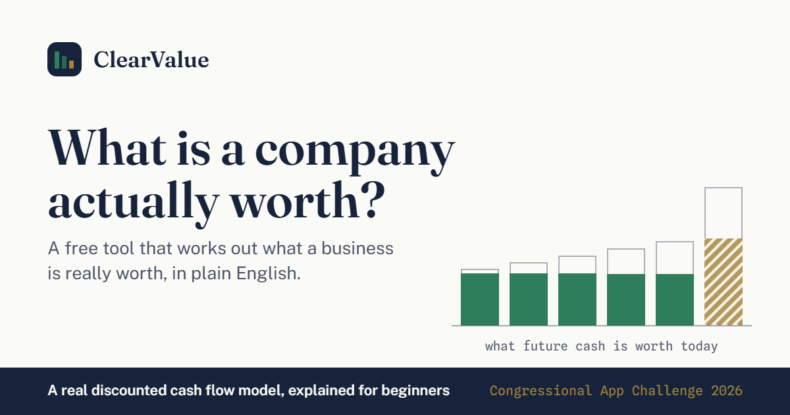

# ClearValue

**Most Americans own stock through a retirement account and have never seen how
a company's worth is actually calculated.** That knowledge sits behind
expensive terminals and finance degrees. ClearValue runs the same discounted
cash flow model professionals use, and explains every step in plain English —
so anyone can work out what a company is worth and understand why.

Built for the 2026 Congressional App Challenge.

**Live: https://aleemahmad101.github.io/congressional-app-challenge/**

<!-- TODO-ALEEM: replace with a real screenshot of the results screen. -->



---

## For judges — 30 seconds

**What it is.** A free web app that estimates what a company is worth from the
cash it generates. No accounts, no tracking, no server, no ads. Everything runs
in your browser.

**What to click.**

1. Pick **Nike** (or any company) from the grid.
2. Look at the big number, then the sentence beside it — that's the whole
   answer in plain English.
3. **Drag the discount-rate slider.** Watch the solid green bars shrink in real
   time. That gap between the faint outline and the solid bar *is* the concept
   of discounting: a dollar in 2031 is worth less than a dollar today.
4. Read the line that starts **"Today's price implies…"** — this is the
   interesting one. It works the model backwards to show what growth rate the
   market must be assuming. The gap between that and your assumption is the
   whole point: **a valuation is an argument about the future, and the gap
   measures how much you disagree with everyone else.**

**Explain everything** is on by default — every underlined term opens a
beginner definition, and a three-step tour walks you through the chart.

**This is an educational tool, not investment advice.**

---

## ⚠ Data status: NOT YET VERIFIED

**The bundled company figures are currently sample data.** They are placeholders
and have not been checked against any filing. The app says so on screen wherever
a figure appears.

Replacing them is tracked in **[`data/VERIFICATION.md`](data/VERIFICATION.md)**,
and enforced by a script:

```bash
npm run check:data
```

It fails, listing exactly what is missing, until every figure has been taken
from a company's 10-K and its source recorded. **Deployment is blocked until it
passes** — `npm run deploy` runs it first and refuses to build otherwise.

Once it passes, the on-screen wording changes automatically from "sample
financial data (verification in progress)" to citing the annual report. Nothing
overstates what has actually been checked.

No real company logos or trademarks are used anywhere. Cards render a generated
two-letter monogram from the ticker.

---

## Running it

```bash
npm install
```

```bash
npm run dev
```

Then open the URL it prints (http://localhost:5174).

| Command | What it does |
| --- | --- |
| `npm run dev` | Development server with hot reload |
| `npm test` | Runs the unit tests once |
| `npm run test:watch` | Re-runs tests as you edit |
| `npm run check:data` | **Fails until every company figure is verified** |
| `npm run build` | Type-checks, then writes a static site to `dist/` |
| `npm run preview` | Serves the built `dist/` locally |
| `npm run deploy` | Checks data, builds, publishes to GitHub Pages |
| `npm run lint` | Lints the source |

### Deploying

```bash
npm run deploy
```

`predeploy` runs `check:data` first, so an unverified build cannot ship. The
output is a plain static site — HTML, one CSS file, one JS file, no backend.

`vite.config.ts` sets `base: './'` so the build works from a GitHub Pages
project subpath as well as from a domain root. If the deployed URL ever
changes, update the four absolute `og:` / `twitter:` URLs in `index.html` —
link scrapers do not resolve relative paths.

---

## How the model works

All the maths lives in [`src/lib/dcf.ts`](src/lib/dcf.ts) as pure functions with
no React and no I/O, so it can be tested directly.

1. Project free cash flow for years 1–5: `FCF_t = fcf0 × (1 + g)^t`
2. Discount each year back to today: `PV_t = FCF_t / (1 + r)^t`
3. Terminal value at year 5 (Gordon growth): `TV = FCF_5 × (1 + gT) / (r − gT)`,
   discounted by `1 / (1 + r)^5`
4. Enterprise value = the five present values + the discounted terminal value
5. Equity value = enterprise value + cash − debt
6. **Fair value per share = equity value ÷ shares outstanding**
7. Upside = (fair value − market price) ÷ market price

A guardrail keeps terminal growth at least 1.5 points below the discount rate.
Below that the Gordon growth denominator collapses and fair value runs off to
infinity — mathematically valid, economically nonsense. When the guardrail
fires, the UI says so rather than quietly changing the answer.

### The reverse question

`impliedGrowth()` runs the model backwards: holding the discount rate and
terminal growth fixed, it binary-searches for the five-year growth rate that
would make today's price exactly right. Fair value rises monotonically with
growth, so the search always converges — and returns `null` rather than a
pinned bound when the price is unreachable.

This is what turns "the app says everything is overvalued" into the actual
lesson. A strict required return genuinely does make most large companies look
expensive; the app says so out loud when it detects that most of the bundle is
reading that way.

### About the chart's scale

The terminal value is typically **sixteen times taller** than any single
projected year, so it cannot share a linear axis with them without squashing
the year bars flat. ClearValue does not solve this with a hidden second axis.
The five year bars set the scale; the terminal bar is drawn to that same scale
divided by a round number, and **the chart states the divisor on screen**
("drawn at 1/10 scale so it fits"). Tooltips always report real dollars.

That the last bar dwarfs the others is not a drawing problem — it is the single
most important thing a discounted cash flow model has to teach. Most of a
company's value is the cash it makes after the forecast ends.

---

## Tests

```bash
npm test
```

98 tests covering the parts that have to be right:

- **`dcf.test.ts`** — the model. A zero-growth case collapses to a perpetuity
  (`EV = FCF / r`), which makes the expected numbers checkable by hand. Also the
  terminal-spread guardrail, negative equity from heavy debt, the reverse-DCF
  search, verdict banding, the sensitivity grid, and every formatting helper.
- **`river.test.ts`** — chart geometry. Asserts that across the *entire* slider
  range the terminal bar stays inside the plot yet remains taller than every
  year bar, that touch targets never overlap, and that the compact mobile layout
  clears 44px targets while reaching the same numbers as the wide one.
- **`spotlight.test.ts`** — which company leads the suggestions, and when the
  "strict assumptions" note fires. Both computed, never hardcoded.
- **`plausibility.test.ts`** — typo detection for hand-entered company
  figures. Knows nothing about any specific company; catches the digit slips
  that no type checker or unit test would.
- **`manual.test.ts`** — hand-entered input validation.

---

## What's in here

```
src/
  lib/
    dcf.ts          The valuation model, forwards and backwards. Pure functions.
    river.ts        Chart geometry, including the scale-break logic.
    spotlight.ts    Questions about the bundle as a whole.
    manual.ts       Validation for hand-entered figures.
    plausibility.ts Typo detection for the bundled figures.
  data/
    companies.ts    10 bundled companies (SAMPLE DATA — see above).
    glossary.ts     Definitions for "Explain everything" mode.
  components/       One component per piece of the page.
  hooks.ts          Media queries, number tweening, print handling.
  styles.css        The whole design system in one file.
scripts/
  check-data.ts     The deploy gate.
data/
  VERIFICATION.md   The per-company checklist.
```

No component library and no CSS framework — the look is hand-built on purpose.
State is `useState` only; there is no router, no store, and no backend.

---

## Design and accessibility notes

- One theme, deliberately. A dark mode would double the QA surface for no gain
  to a judge watching a two-minute demo.
- Type: **Fraunces** for display figures, **Public Sans** for the interface —
  the U.S. government's own open-source typeface, a quiet nod for a
  congressional competition — and **Spline Sans Mono** with tabular figures for
  every number, so digits never shift as values change.
- Every control is keyboard operable with a visible focus ring, including the
  chart bars. The verdict is an `aria-live` region, so screen readers announce
  the recalculation when a slider moves.
- All animation is under 200ms and stops entirely under
  `prefers-reduced-motion`.
- A `@media print` pass gives a judge who prints the page a clean one-pager:
  controls disappear, collapsed sections expand, and the assumptions behind the
  headline figure are restated as text.
- Tested down to 375px, where the chart switches to a squarer layout rather
  than shrinking its labels into illegibility.

---

## License

[MIT](LICENSE).
