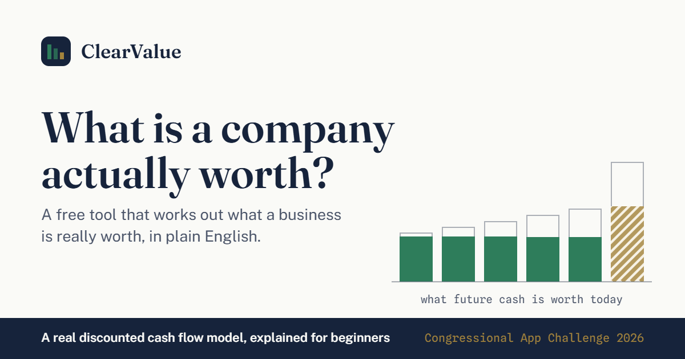

# ClearValue

**Most Americans own stock through a retirement account and have never seen how
a company's worth is actually calculated.** That knowledge sits behind
expensive terminals and finance degrees. ClearValue runs the same discounted
cash flow model professionals use, and explains every step in plain English —
so anyone can work out what a company is worth and understand why.

Built for the 2026 Congressional App Challenge.

**Live: https://aleemahmad101.github.io/congressional-app-challenge/**
(currently an older preview build — see [Project status](#project-status))

<!-- TODO-ALEEM: replace with a real screenshot of the results screen. -->



---

## Project status

| | |
| --- | --- |
| **Code on `main`** | The redesigned app: 63 companies, six-step valuation, SEC data pipeline. 148 tests passing. |
| **Live site** | Still the earlier preview build. It updates only when `npm run deploy` is run. |
| **Company data** | 10 companies can be valued today, 9 of them on labelled **sample** figures. 47 show "Figures needed" until `npm run data:fetch` is run. 6 are explained rather than valued. |
| **Deploy gate** | `npm run deploy` refuses to publish while any sample figure is on screen. |

**To finish before submission:**

1. `SEC_USER_AGENT="Your Name you@example.com" npm run data:fetch` — loads every
   company's reported figures from its 10-K.
2. Add a share price and date for each company in `src/data/catalog.ts`, and
   replace the nine sample entries (each is marked `// VERIFY`).
3. `npm run check:data` until it prints `✓ No sample data on screen`.
4. `npm run deploy`.

The full checklist is in [`TODO-ALEEM.md`](TODO-ALEEM.md).

---

## For judges — 30 seconds

**What it is.** A free web app that estimates what a company is worth from the
cash it generates. No accounts, no tracking, no server, no ads. Everything runs
in your browser.

**What to click.**

1. On the home page, pick **Nike** (or any company) from **Start here**, or
   search 60+ companies by name, ticker, industry, or what they sell.
2. Walk the six numbered steps: **the business today** (reported figures, each
   linked to its source) → **your assumptions** (gold = your call) → **the
   five-year projection** → **bring it back to today** → **your estimate** →
   **what changed the result**.
3. **Drag a slider.** The live estimate in the sticky bar, every chart, and the
   "why" section all update instantly.
4. In step 6, tap a cell of the **sensitivity table**: valuation is a range,
   not one magic number.

**Explain everything** (top right) is on by default. Off, the page is clean
labels and numbers; on, every step gains plain-English explanations and
tappable definitions.

**This is an educational tool, not investment advice.**

---

## Company data: how it works

63 companies across 7 sectors live in **one file**, `src/data/catalog.ts`. It
holds identity only (name, ticker, sector, one plain sentence) plus anything
typed in by hand.

Reported financial figures come from **SEC EDGAR**, the SEC's free XBRL data,
via one command:

```bash
SEC_USER_AGENT="Your Name you@example.com" npm run data:fetch
```

That downloads each company's 10-K data and writes
`src/data/sec-financials.json`. Every figure records the XBRL concept, the
filing's accession number, the period and the filing date, and the app links
each number to its filing. Nothing is estimated: a figure the filing data does
not contain stays missing, and the app says so.

Trust order for each figure (`src/data/companies.ts`):

1. SEC filing data
2. Hand-entered figures with a recorded source
3. **Sample data** — the original placeholders, labelled in red wherever they appear
4. Missing — the company is shown as "figures needed", never guessed

Share prices are not in SEC filings, so they are entered by hand in
`catalog.ts` with an as-of date. A company without a price is still valued; it
just shows no market comparison.

Banks, card lenders and Berkshire Hathaway are marked `notSuitable`. The app
explains why a free-cash-flow model is the wrong tool for them instead of
printing a meaningless number. Companies with negative free cash flow are
explained the same way.

```bash
npm run check:data
```

This reports coverage, plausibility warnings (digit slips), and import notes.
**It blocks deployment while any valuable company still shows sample figures.**
See [`data/VERIFICATION.md`](data/VERIFICATION.md).

No real company logos or trademarks are used anywhere. Cards render a
two-letter monogram.

---

## Running it

```bash
npm install
```

```bash
npm run dev
```

Then open the URL it prints (http://localhost:5174).

| Command | What it does |
| --- | --- |
| `npm run dev` | Development server with hot reload |
| `npm test` | Runs the unit tests once |
| `npm run test:watch` | Re-runs tests as you edit |
| `npm run data:fetch` | Downloads reported figures from SEC EDGAR (needs `SEC_USER_AGENT`) |
| `npm run check:data` | **Fails while any sample figure is on screen** |
| `npm run build` | Type-checks, then writes a static site to `dist/` |
| `npm run preview` | Serves the built `dist/` locally |
| `npm run deploy` | Checks data, builds, publishes to GitHub Pages |
| `npm run lint` | Lints the source |

### Deploying

```bash
npm run deploy
```

`predeploy` runs `check:data` first, so an unverified build cannot ship. The
output is a plain static site — HTML, one CSS file, one JS file, no backend.

`vite.config.ts` sets `base: './'` so the build works from a GitHub Pages
project subpath as well as from a domain root. If the deployed URL ever
changes, update the four absolute `og:` / `twitter:` URLs in `index.html` —
link scrapers do not resolve relative paths.

---

## How the model works

All the maths lives in [`src/lib/dcf.ts`](src/lib/dcf.ts) as pure functions with
no React and no I/O, so it can be tested directly.

1. Project free cash flow for years 1–5: `FCF_t = fcf0 × (1 + g)^t`
2. Discount each year back to today: `PV_t = FCF_t / (1 + r)^t`
3. Terminal value at year 5 (Gordon growth): `TV = FCF_5 × (1 + gT) / (r − gT)`,
   discounted by `1 / (1 + r)^5`
4. Enterprise value = the five present values + the discounted terminal value
5. Equity value = enterprise value + cash − debt
6. **Estimated value per share = equity value ÷ shares outstanding**
7. Difference = (estimated value − reference price) ÷ reference price, shown
   only when a reference share price has been recorded

A guardrail keeps terminal growth at least 1.5 points below the discount rate.
Below that the Gordon growth denominator collapses and fair value runs off to
infinity — mathematically valid, economically nonsense. When the guardrail
fires, the UI says so rather than quietly changing the answer.

### The reverse question

`impliedGrowth()` runs the model backwards: holding the discount rate and
terminal growth fixed, it binary-searches for the five-year growth rate that
would make the reference price exactly right. Fair value rises monotonically with
growth, so the search always converges — and returns `null` rather than a
pinned bound when the price is unreachable.

This is what turns "the app says everything is overvalued" into the actual
lesson. A strict required return genuinely does make most large companies look
expensive; the app says so out loud when it detects that most of the bundle is
reading that way.

### About the chart's scale

The terminal value is typically **sixteen times taller** than any single
projected year, so it cannot share a linear axis with them without squashing
the year bars flat. ClearValue does not solve this with a hidden second axis.
The five year bars set the scale; the terminal bar is drawn to that same scale
divided by a round number, and **the chart states the divisor on screen**
("drawn at 1/10 scale so it fits"). Tooltips always report real dollars.

That the last bar dwarfs the others is not a drawing problem — it is the single
most important thing a discounted cash flow model has to teach. Most of a
company's value is the cash it makes after the forecast ends.

---

## Tests

```bash
npm test
```

148 tests covering the parts that have to be right:

- **`dcf.test.ts`** — the model, the terminal-spread guardrail, the reverse-DCF
  search, the sensitivity grid, and every formatting helper.
- **`sec.test.ts`** — the SEC parser: annual-only values, restatements, tag
  fallbacks, cash + short-term investments, debt lines, share classes, and
  that missing figures stay missing.
- **`companies.test.ts`** — the trust order, sample labelling, statuses, the
  derived starting growth, catalog integrity, and search.
- **`insights.test.ts`** — the value bridge adds up exactly, driver attribution,
  guardrail warnings, and URL state round-trips.
- **`river.test.ts`**, **`spotlight.test.ts`**, **`plausibility.test.ts`**,
  **`manual.test.ts`** — chart geometry, bundle-wide checks, typo detection,
  hand-entry validation.

---

## What's in here

```
src/
  lib/
    dcf.ts          The valuation model, forwards and backwards. Pure functions.
    insights.ts     Value bridge, which assumptions mattered, guardrails.
    sec.ts          Reads 10-K figures out of SEC EDGAR company-facts JSON.
    url.ts          Company + assumptions in the address bar (refresh, back, share).
    river.ts        Chart geometry, including the scale-break logic.
    spotlight.ts    Questions about the bundle as a whole.
    manual.ts       Validation for hand-entered figures.
    plausibility.ts Typo detection for figures.
  data/
    catalog.ts      THE list of companies. The only file to edit to add one.
    sec-financials.json  Generated by `npm run data:fetch`.
    companies.ts    Resolves catalog + SEC + hand entries, with provenance.
    types.ts        Company, Figure, Provenance types.
    glossary.ts     Definitions for "Explain everything".
  components/       Hero, HowItWorks, CompanyPicker, ValuationView and its six
                    stages (BusinessToday, AssumptionPanel, ProjectionChart,
                    RiverOfCash, ResultPanel, WhyThisResult), and helpers.
scripts/
  fetch-sec.ts      Downloads reported figures from SEC EDGAR.
  check-data.ts     The deploy gate.
```

No component library, chart library or CSS framework: the charts are hand-built
SVG and HTML, which keeps the whole app around 93 KB of gzipped JavaScript.
State is `useState` plus the URL; there is no router, no store, no backend.

---

## Design and accessibility notes

- One theme, deliberately. A dark mode would double the QA surface for no gain
  to a judge watching a two-minute demo.
- Type: **Fraunces** for display figures, **Public Sans** for the interface —
  the U.S. government's own open-source typeface, a quiet nod for a
  congressional competition — and **Spline Sans Mono** with tabular figures for
  every number, so digits never shift as values change.
- Every control is keyboard operable with a visible focus ring, including the
  chart bars and the sensitivity table. A skip link jumps past the header.
- Animation is 150–350ms and stops entirely under `prefers-reduced-motion`.
- Every hover interaction also works on click, tap and keyboard focus. Charts
  carry text summaries for screen readers, and the estimate is announced
  through a single polite live region.
- A `@media print` pass gives a judge who prints the page a clean one-pager:
  controls disappear, collapsed sections expand, and the assumptions behind the
  headline figure are restated as text.
- Tested at desktop, tablet and 375px phone widths with no horizontal
  scrolling. The company grid goes from four columns to one, the step bar
  collapses to "step X of 6" plus the live estimate, and the River of Cash
  switches to a squarer layout rather than shrinking its labels.

---

## License

[MIT](LICENSE).
